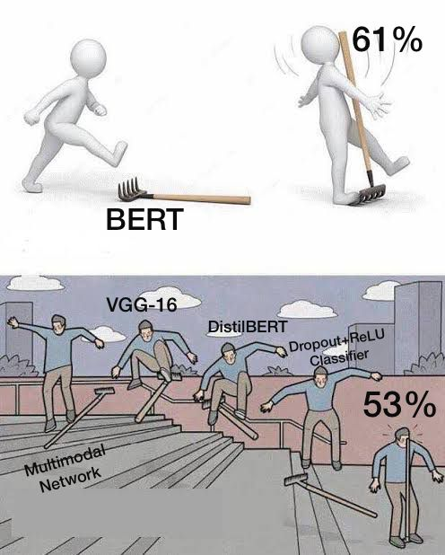

# Judge a book by it's cover

## Tested:

- Random guessing: 1/30 ~ 3% accuracy
- VGG-16: 21% accuracy
- BERT: 61% accuracy
- VGG-16 + BERT multimodal: 53% accuracy

## Takeaways

- Train exclusively via pytorch (No huggingface trainer)
- Use simple Datasets; perform transformations on the network rather than while
  loading the Dataset

## Roadmap

The plan ahead is to train the model as a late fusion multimodal model with 
pretrained subnets. Effectively, use SoTA models as feature extractors and 
train a classifier on the extracted features. More specifically, what we'll do
is:

0. [ ] Data cleaning? Remove punctuations (;,.) from dataset

1. [ ] Vision model pretraining: Train a SoTA vision model that will output:

    - It's predictions in the form of a logit vector for each example
    - It's second-to-last layer: these represent the features it has extracted 
      from the data
  
    Candidate Models:
  
    - [X] ResNet-50
    - [X] VGG
    - [ ] Inception?
  
2. [ ] Language model pretraining: Train a SoTA language model that will output:

    - Logit predictions (like before)
    - Feature vector: 512 features that it extracts from the title (the CLS token
      basically).
    
    Candidate Models:

    - [X] bert-base-cased
    - [ ] bert-base-uncased
    - [ ] distilbert-base-cased
    - [X] distilbert-base-uncased

3. [ ] Classifier: given the encodings returned by Language model L and Vision 
   model V, create a classifier that encapsulates the best of these. The features
   available are:

    - Vision Encoding
    - Vision Logits 
    - Language Encoding 
    - Langauge Logits

    Try out different permutations and combinations of these and train the 
    following classifiers on them:

    - [ ] Simple Naive Bayes (VL-LL, choose the one with higher probability of 
          being right given a class label
    - [ ] SVM's (VE-LE and VL-LL)
    - [ ] Boosted decision trees (VE-LE and VL-LL)

